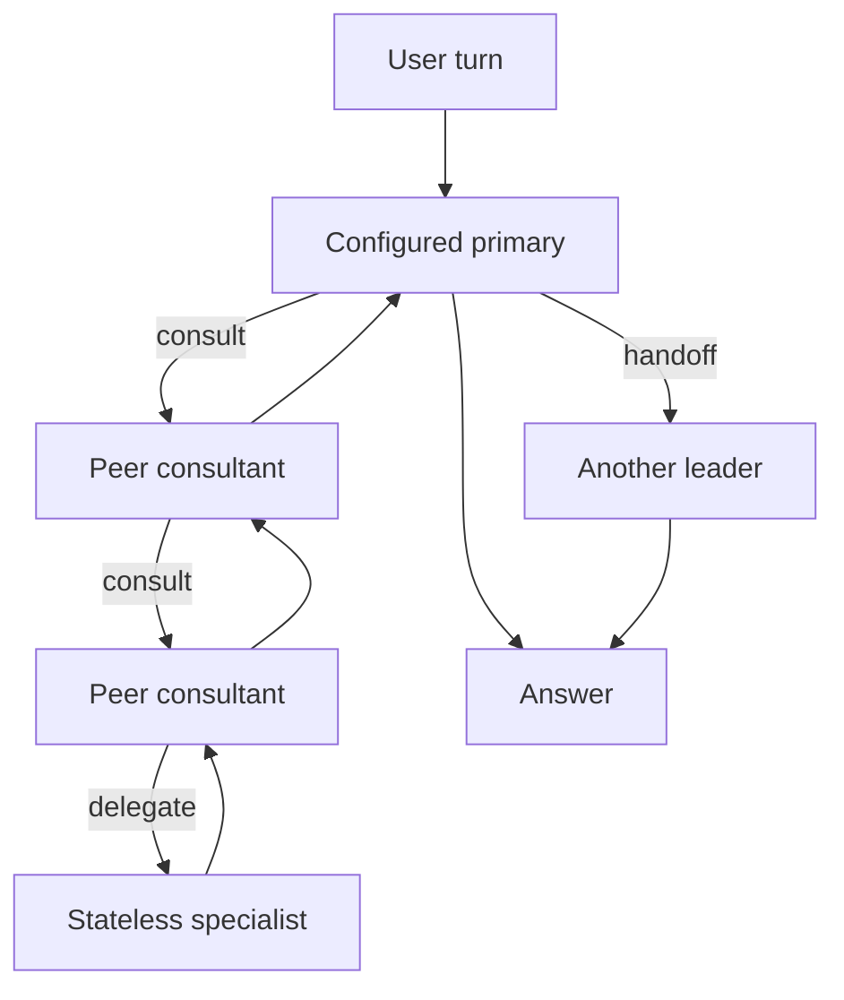

# alt-fx

```
 ⠀⠀⠀⠀⠀⠀⣠⣾⣿⣿⣿⠀⠀⠀⠀⠀⠀⠀⠀
 ⠀⠀⠀⠀⠀⢰⣿⡿⠀⠀⠀⠀⠀⠀⠀⠀⠀⠀⠀
 ⠀⠀⠀⣠⣶⣿⣿⣷⣶⡶⣶⣶⣆⠀⠀⠀⣴⣶⣶⠆
 ⠀⠀⠀⠉⢹⣿⣿⠉⠉⠀⠘⢿⣿⣧⣀⣾⣿⡿⠃⠀             Tiny, open, embeddable, native coding agent.
 ⠀⠀⠀⠀⣼⣿⡏⠀⠀⠀⠀⠀⠻⣿⣿⣿⠟⠀⠀⠀
 ⠀⠀⠀⢀⣿⣿⠃⠀⠀⠀⠀⢠⣦⠘⢿⣿⣷⡀⠀⠀             curl -fsSL https://fx.sh/setup.sh | bash
 ⠀⠀⠀⣸⣿⡟⠀⠀⠀⠀⣰⣿⣿⠗⠀⠻⣿⣿⣄⠀
 ⠀⠀⠀⣿⣿⠇⠀⠀⠀⠾⠿⠿⠋⠀⠀⠀⠘⠿⠿⠦             ⚠ Status: Experimental. Use at your own risk.
  ⠀⣸⣿⡿⠀⠀⠀⠀⠀⠀⠀⠀⠀⠀⠀⠀⠀⠀⠀
 ⣿⣿⣿⠟⠀⠀⠀⠀⠀⠀⠀⠀⠀⠀⠀⠀⠀⠀⠀
```

alt-fx is a fork of [vercel-labs/fx](https://github.com/vercel-labs/fx) with ALT's recursive multi-model Team orchestration bundled as a first-class, replaceable extension.

fx remains the harness. Its terminal UI, model clients, credentials, permission engine, tools, filesystem access, process execution, and persistence infrastructure remain native. ALT owns only Team definitions, leadership, consultations, specialist projections, bounded orchestration context, and the rules by which results return.

**Development status:** the ALT orchestration runtime and its fx host integration are wired in and exercised, but ALT is not yet usable as an end-user feature. The product does not yet provide the Team creation, selection, revision, and ALT-session workflows needed to use that runtime. `/alt` currently exposes the bundled development Team so the integration can be verified while those workflows are built.

ALT is compiled into normal alt-fx builds, but **ALT mode is not active when the application starts**. alt-fx opens in native fx. `/alt` and `/alt off` are currently development-facing entry and exit commands.

The underlying harness remains optimized for research and embeddability as part of larger systems.

It focuses on minimalism and performance across the board, from system prompt design to its tools, feature set, and compact native binary.

For end users, its CLI output style and form factor aim to be closer to a Unix shell than a heavy "IDE in the terminal" TUI.

It's open source (Apache-2.0), model-agnostic, and suitable for both local and cloud inference.

## Build and run

Building alt-fx requires [Zig 0.16.0+](https://ziglang.org/download/):

```bash
git clone https://github.com/ALT-Infra/alt-fx.git
cd alt-fx
zig build -Doptimize=ReleaseSafe
./zig-out/bin/fx
```

## Run fx

Sign in with Vercel AI Gateway:

```bash
fx login
```

Or use an eligible ChatGPT subscription through OpenAI Codex OAuth:

```bash
fx login codex
fx
```

Or use an eligible Grok subscription through xAI OAuth:

```bash
fx login grok
fx
```

Or use an OpenCode Zen or Go API key:

```bash
export OPENCODE_API_KEY=<your-opencode-api-key>
fx login opencode
fx
```

The provider-specific login commands select that provider and a model from its live catalog. Inside fx, open `/setup`, use **Connections** to manage sign-ins, and choose **Model provider** to move between Gateway, Codex, Grok, and OpenCode. `/model` lists the active provider's supported fetched models. Use `/logout codex`, `/logout grok`, or `/logout opencode` to remove that saved provider session without affecting the others; choosing it again from **Connections** starts sign-in.

The OpenAI Codex route uses ChatGPT subscription access directly and never sends its OAuth token to Vercel AI Gateway. The session is stored privately at `~/.fx/chatgpt-auth.json` and refreshed when needed. On supported Codex models, `/fast` requests OpenAI's priority service tier and consumes ChatGPT credits at the higher Fast mode rate.

The Grok route uses subscription access directly at xAI and never sends its OAuth token to Vercel AI Gateway or OpenAI. Its session is stored privately at `~/.fx/grok-auth.json`, refreshed when needed, and used only with the authenticated xAI catalog and Responses API.

`fx login opencode` imports `OPENCODE_API_KEY` into a private copy at `~/.fx/opencode-auth.json`; later commands use that saved copy, so `fx logout opencode` remains effective even while the environment variable is exported. The OpenCode route sends the saved key only to OpenCode. fx currently lists the Zen and Go models whose published endpoint uses OpenAI-compatible Chat Completions; models requiring OpenAI Responses, Anthropic Messages, or Gemini protocols remain hidden. Go model IDs use the `go/<model-id>` prefix in fx.

To use an AI Gateway API key instead:

```bash
fx setup
```

Run fx from a project:

```bash
cd your_project
fx
```

The current directory becomes the primary workspace. Enter a prompt, or run `/help` to browse interactive commands. While fx is working, press Enter to queue a follow-up or Ctrl+Enter to steer the active turn at its next model boundary. If the turn has already closed, fx safely queues the steering prompt as the next turn.

Tool calls are expanded by default. Enable `Collapse tool calls` in `/settings`, or set `"collapse_tool_calls": true` in `~/.fx/settings.json`, to show one summary per tool-call group in the main transcript. Individual calls remain available in the full transcript with Ctrl+O.

## ALT development interface

Enter the temporary bundled Engineering Team explicitly:

```text
/alt
```

Leave it without leaving fx:

```text
/alt off
```

Every user turn in ALT mode enters through the Team's configured primary peer. Exactly one peer holds leadership at a time and may answer, hand leadership to an authorized peer, or coordinate Team work.



The runtime enforces these boundaries:

- A consultation never transfers leadership or answers the user.
- A consultant may call its own authorized peers and specialists.
- Nested results return only to the immediate caller and unwind one frame at a time.
- Context-bearing peer surfaces are serialized while unrelated child work may run concurrently.
- Specialist batches may express dependency ordering with `depends_on`.
- Specialists are clean-slate leaf calls with bounded projections, selected attachments, and fx's real tools—but no conversation or Team state.
- Every new user turn starts at the configured primary, regardless of who answered the previous turn.

This compiled Team is an integration fixture, not the intended Team-management surface. It currently uses OpenCode Go models. Native Codex, Grok, and fx subagents are unavailable inside ALT mode; `/alt off` restores the complete native fx environment.

The status line hides the workspace path and Git branch by default. Enable the `Status line workspace` option in `/settings`, run `/statusline workspace`, or set it in `~/.fx/settings.json`:

```json
{
  "statusLine": {
    "workspace": true
  }
}
```

List saved sessions with `fx sessions`. Resume the latest session for the current workspace, or select an exact session ID, through the same command group:

```bash
fx session resume last
fx session resume --id <id>
```

Each interactive session names its terminal tab. The title prefers the session name, falls back to the workspace name, and keeps the active model as secondary context. Renaming or resuming a session updates the tab, and exiting clears the fx-owned title. Noninteractive commands do not emit terminal-title controls.

Run `/feedback` to open the feedback form at `fx.sh/feedback`. It does not create a diagnostic or change the clipboard.

Run `/trace` to create a private Markdown diagnostic with logs, session context, runtime state, permissions, and recent activity. On macOS, fx copies the `.md` file to the clipboard; on other platforms, it saves the file and prints its path. Review and redact the trace before sharing it.

Use `fx ask` for a single request:

```bash
fx ask "explain the changes in this repository"
```

With `--json`, `output` contains accumulated assistant Markdown across the request, while `final_output` contains only a completed final assistant response and is `""` for interrupted, failed, background, or otherwise absent final responses.

Foreground terminal commands run with an explicit finite deadline. fx uses durable terminal sessions for services, watchers, GUI applications, and other long-lived work, and keeps captured foreground output available through an opaque bounded-read handle for the active session or `--no-save` process.

fx starts in `auto` permission mode. Routine understood development actions run directly. Each unresolved action receives one narrow safety review based on the current user request and the exact pending action. A clear result authorizes only that action. A caution or unavailable review holds the action and returns advice to the agent without opening a permission prompt or ending the turn. See [Permissions](https://fx.sh/docs/configure-fx/permissions) for other modes and persistent rules.

JSON and quiet requests stay noninteractive by default. Add `--prompt-permissions` to allow configured approval prompts when stdin is a TTY. Automatic safety review never opens that prompt. Prompt text is written to stderr, so JSON stdout stays parseable and quiet stdout stays empty. Piped or redirected stdin remains noninteractive and fails instead of waiting for approval.

Inside a saved session, `/permissions remember <allow|deny> <tool-name> <arguments-json>` stores an exact confirmed rule without running the action. `/permissions` lists stable rule IDs, and `/permissions revoke <rule-id>` removes a stored rule even when its original workspace or file state has changed.

## Embed fx

fx builds as a native binary or WebAssembly. Applications embedding fx can provide network transport, session storage, configuration, permission handling, and terminal I/O.

| Surface | Use |
| --- | --- |
| `fx acp` | Connect the native agent to editors and other Agent Client Protocol clients. |
| `createFxAgent()` | Embed the agent core in a JavaScript host with `fx-core.wasm`. |
| `createFxTerminal()` | Embed the interactive terminal with `fx-term.wasm`. |

The WebAssembly SDK is experimental. See the [WebAssembly SDK](sdk/README.md) and [ACP documentation](https://fx.sh/docs/using-fx/acp).

## Extend fx

Add reusable instructions with [skills](https://fx.sh/docs/capabilities/skills), connect external tools through [MCP](https://fx.sh/docs/capabilities/mcp), or delegate independent work to [subagents](https://fx.sh/docs/capabilities/subagents) in native fx. Run `fx mcp add NAME COMMAND [ARGS...]` for a local server or `fx mcp add --transport http NAME URL` for Streamable HTTP without opening the interactive shell; the equivalent `/mcp add` forms remain available inside fx. A workspace may also provide Claude-compatible `.mcp.json` with a top-level `mcpServers` object. Pending project servers stay disconnected on every surface until they are approved with `/mcp trust approve <server>` or `fx mcp trust approve <server>`. Interactive fx presents the trust prompt after startup. `fx ask` reports skipped pending servers on stderr, and ACP leaves them unavailable. Repository files cannot persist approval or expose environment-expanded values before approval. `/mcp trust reject <server>` rejects one and `/mcp trust reset` clears the workspace choices. Profile entries win same-name collisions. Profile `~/.fx/mcp.json` accepts `mcpServers` as an alias for `mcp`, while writes always use `mcp` and ambiguous server-like keys produce a visible warning. Project instruction files may link within their scope, and read-only workspace or compatibility skill directories and their primary `SKILL.md` files may link within their owning workspace or home; managed skills, secondary resources, and escaping links remain no-follow. Skills installed via symlinks that resolve outside home or workspace (e.g. Nix store paths) are loaded when their resolved target is inside a directory listed in the `FX_SKILL_SYMLINK_AUTHORITIES` environment variable (colon-separated absolute paths). `fx status` and `fx doctor` report invalid or suspicious trusted MCP profiles without starting their servers.

Use `fx mcp list`, `fx mcp path`, and `fx mcp remove NAME` for noninteractive profile management. `fx mcp trust approve|reject NAME`, `fx mcp trust approve-all`, and `fx mcp trust reset` manage workspace-scoped project trust. `fx mcp auth NAME` and `fx mcp logout NAME` run the existing remote credential lifecycle without opening the TUI or contacting the Gateway.

MCP servers have a 30-second startup timeout by default; set `startup_timeout_ms` on a server when its cold start needs a different bound. For direct `docker run` stdio entries, fx uses a private container ID file to remove the owned container after shutdown or startup failure. A configuration that already supplies `--cidfile` keeps ownership of its own cleanup policy.

## Documentation

Read the [fx documentation](https://fx.sh/docs).

## Build modes

The normal build selects the bundled ALT implementation but does not activate its mode at startup:

```bash
zig build -Doptimize=ReleaseSafe
```

Build the harness without ALT or any orchestration extension:

```bash
zig build -Doptimize=ReleaseSafe -Dorchestration=none
```

Build against another implementation of the generic host contract:

```bash
zig build \
  -Doptimize=ReleaseSafe \
  -Dorchestration=custom \
  -Dorchestration-root=/absolute/path/to/extension.zig
```

Passing `-Dorchestration-root` by itself is retained as shorthand for the custom mode.

Run the full Zig suite with `zig build test`. Run the paired ALT host suite with `zig build test-orchestration-extension -Dtarget=x86_64-linux-musl`. Crucible also builds the product and drives its real TUI through a PTY with deterministic provider fixtures:

```bash
zig build crucible-host \
  -Dtarget=x86_64-linux-musl \
  -Dbun=/absolute/path/to/bun
```

The bundled implementation lives under `alt/`; the ALT-agnostic host contract and lifecycle infrastructure remain under `src/core/orchestration/`. See [CONTRIBUTING.md](CONTRIBUTING.md) for development and contribution guidelines.

## License

[Apache-2.0](LICENSE)

Third-party licenses and attributions are listed in
[THIRD_PARTY_NOTICES.md](THIRD_PARTY_NOTICES.md).

## Credits

Interface sounds by [cuelume](https://github.com/Danilaa1/cuelume).
